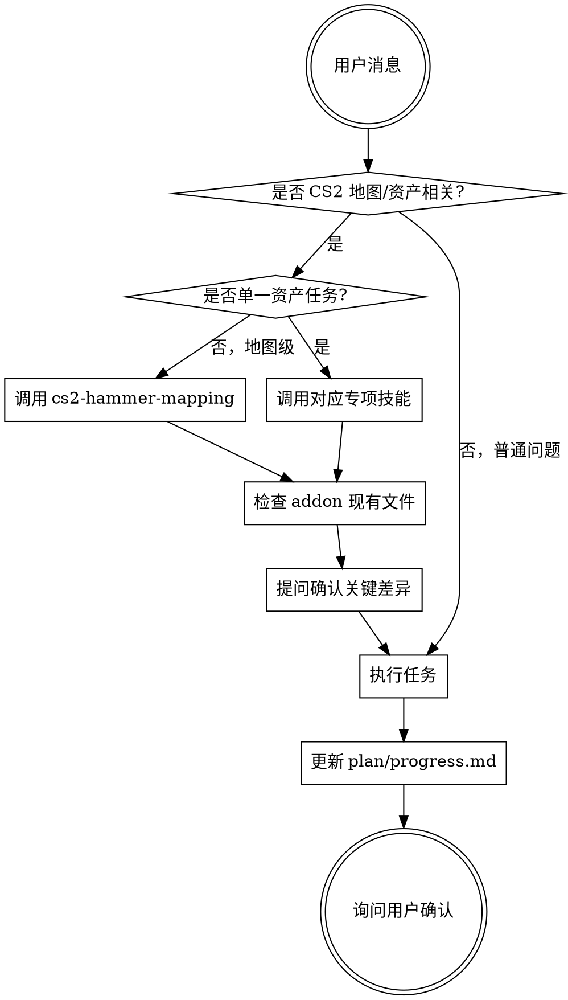

<SUBAGENT-STOP>
如果你是作为子代理被派发执行特定任务，跳过此技能。
</SUBAGENT-STOP>

<EXTREMELY-IMPORTANT>
当用户提出任何与 CS2 地图或资产相关的任务时，你必须调用相应的技能。

如果你认为有哪怕 1% 的可能性某个技能适用于当前任务，你必须调用该技能。

这不是建议，是强制要求。不允许跳过流程直接编造格式。不允许找任何借口。
</EXTREMELY-IMPORTANT>

## 指令优先级

CS2 地图创作技能会覆盖默认系统提示行为，但**用户指令始终优先**：

1. **用户明确指令**（直接请求、CLAUDE.md、AGENTS.md 中的设置）— 最高优先级
2. **CS2 地图创作技能** — 覆盖默认系统行为
3. **默认系统提示** — 最低优先级

如果用户说"不用问，直接生成"，你可以简化流程，但仍需在 `plan/progress.md` 记录。

## 如何访问技能

- **在 Claude Code 中：** 使用 `Skill` 工具。调用技能时，其内容会被加载并呈现给你 — 直接遵循即可。
- **在 Cursor 中：** 技能通过会话启动 hook 自动加载。使用 `Skill` 工具调用其他技能。
- **在 Codex 中：** 技能通过复制/链接 `skills/` 目录加载。参考 `.codex/INSTALL.md`。
- **在 OpenCode 中：** 使用原生 `skill` 工具：`use skill tool to load cs2-mapping/using-cs2-mapping`

## 核心规则

- **在任何响应或行动之前，先调用相关技能。** 即使只有 1% 的可能性某个技能适用，你也应该调用它检查。
- **使用前提：Agent 已在内部打开目标 addon 文件夹**（`content/csgo_addons/<addon>/`），不要询问用户"用在哪张地图/哪个 addon"。
- **先检查再提问。** 查看 addon 现有文件（`materials/`、`models/`、`particles/`、`maps/` 等），找到最接近的模板；只对关键差异提问。
- **批量任务进入批量模式。** 公共设置只问一次，接受规则文件或文件夹级默认值，一次性输出全部结果。
- **资产由 Hammer 自动编译**，不手动运行编译器；保存后在 Hammer 中打开/保存即可。
- **kv3 文件头版本 GUID 从 addon 现有文件复制**，不凭记忆手写。

## 标准流程

## Red Flags（停止并检查）

这些想法意味着你在找借口 — 停下来：

| AI 的想法 | 正确做法 |
|-----------|----------|
| "用户说得很清楚了，直接生成" | 先调用对应专项技能，再检查 addon 现有模板 |
| "这是简单任务，不需要计划" | 地图项目需要 `plan/` 记录 |
| "PNG 直接放进去引擎就能用" | 需要 `.vmat`/`.vtex` 配方文件 |
| "kv3 文件头我默写一个" | 从 addon 现有文件复制版本 GUID |
| "有 metal 图就默认加标志位" | 只有用户提供对应贴图时才加 |
| "直接改二进制 .vmap" | 先用 `dmxconvert` 转成文本再改 |
| "这个实体属性我凭记忆写" | 查官方实体列表与本地 SDK 类型定义 |
| "我记得这个技能的内容" | 技能会更新，必须重新读取当前版本 |

## 技能路由

| 任务类型 | 调用技能 |
|----------|----------|
| 地图级：实体/光照/发布/.vmap 程序化/布局 | cs2-hammer-mapping |
| 材质（.vmat） | cs2-material-creation |
| 纹理定义（.vtex） | cs2-texture-creation |
| 模型（.vmdl） | cs2-model-creation |
| 粒子系统（.vpcf） | cs2-particle-creation |
| 滤镜（.vpost） | cs2-postprocess-creation |
| 自定义声音（.vsndevts / sounds/） | cs2-sound-creation |
| 脚本（cs_script / .js） | cs2-script-creation |
| 技能改造/完整性检查 | scripts/check_skill_integrity.ps1 |

## 技能优先级

当多个技能可能适用时，按以下顺序：

1. **流程技能优先**（cs2-hammer-mapping）— 地图级任务先确定整体流程
2. **资产技能其次**（材质/纹理/模型/粒子/滤镜/声音/脚本）— 指导具体执行

"帮我做一张 CS2 地图" → 先 cs2-hammer-mapping，再按需要路由到资产技能
"把这张 PNG 转成材质" → 直接 cs2-material-creation
"为模型生成 vmdl 和配套材质" → 先 cs2-model-creation，检测到无同名 vmat 时转 cs2-material-creation

## 技能类型

- **严格型**（cs2-hammer-mapping、cs2-material-creation、cs2-model-creation、cs2-particle-creation、cs2-postprocess-creation、cs2-sound-creation、cs2-script-creation）：必须严格遵循，先提问再动手。
- **灵活型**（无）：本套件所有专项技能都要求先检查 addon 与确认关键差异。

## 用户指令

用户指令说的是"做什么"，不是"怎么做"。"生成 50 个材质"或"做个粒子"不代表跳过工作流。

## 任务收尾

中型及以上任务完成前必须更新 `plan/progress.md`（含 capability-use audit，记录应使用的技能、实际使用的技能、已消费资料、未使用资料及原因、产物、验证命令和剩余风险）。缺少记录时，不得声称任务完成。
